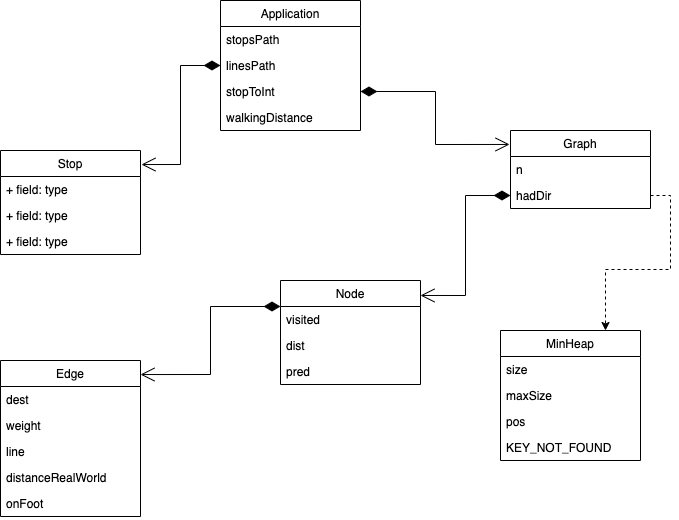
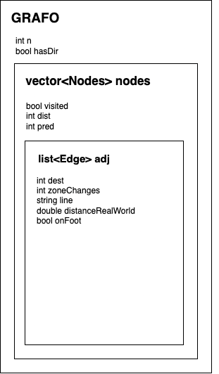

# STCP Routing System

## Project Goal

The goal of the project was to implement a system providing assistance to individuals using public transportation in Porto, specifically the bus network managed by the Sociedade de Transportes Colectivos do Porto (STCP). The project involved working with real data, including information about bus stops, their locations, existing bus lines, and the sequence of stops for each line in both directions.

The primary task was to create a system that, given two locations, could determine the "best" route using the STCP bus network. Different versions of "location," "best" route, and the ability to change buses were implemented to accommodate various user preferences. For example:

- "Location" could refer to a specific bus stop or a geographical coordinate, allowing users to see nearby stops.
- "Best" route could mean the route with fewer stops, a shorter distance, fewer bus changes, lower cost (fewer fare zones), etc.
- Changing buses could involve transferring at a bus stop or walking a short distance to another nearby stop.

To achieve maximum points, the program implemented different versions of these concepts and utilized breadth-first search (BFS) for unweighted graphs and Dijkstra's algorithm for finding the shortest paths in weighted graphs. If distances were included, the Haversine formula was used to calculate the distance between two points given their latitudes and longitudes.

The code was well-documented using Doxygen, and the complexity of the more algorithmic methods was indicated. Additional features that enhanced the project included handling daytime and nighttime travels, illustrating the use of algorithms for calculating minimum spanning trees (MST), allowing the closure of selected stops or lines, and incorporating stops and lines from other modes of transportation (e.g., metro or train).

## Dataset

Os dados estão disponíveis em dataset.zip sob a forma de ficheiros csv (comma separated values) e foram
obtidos diretamente a partir do site dos STCP.

The dataset used was obtained directly from the STCP website. This dataset contains multiple CSV files with information about bus stops, their locations, existing bus lines, and the sequence of stops for each line in both directions.

## Implementation

### Class Diagram



### Dataset Parsing

- *readStops()* - reads the information about bus stops from the *stops.csv* file and saves them on a vector called *stops*

- *readEdges()* - reads the file *lines.csv* and proceeds to run the function *addEdge()*

- *addEdges()* - bus stops are read line by line from the files *line_xxx_0x.csv* (in both directions) and these bus stops nodes and line edges are then added to *Edges* and *Nodes* lists.

- With the input of the user, the program chooses if it will use only day or night routes. On top of that, it will ignore bus stops and lines that the user does not want to use.

- Lastly, new edges are created between stops where the distance is equal or less than the distance the user is willing to walk.

### Graphs



**Explanation of variables:**

Graph:
- n - size of graph
- hasDir - direction boolean
- nodes - vector that saves *Node* structs
- forbiddenLines - list of codes of lines that need to be ignored by the path search algorithms

Node Struct:
- visited - boolean that defines if a node has been visited by an algorithm
- dist - double value that contains the distance
- pred - previous node, if it exists
- adj - list of edges that are connected to the node

Edge Struct:
- dest - destiny node
- zoneChanges - indication of a change of zone
- line - name of the line
- distanceRealWorld - distance between stops
- onFoot - true if its a walkable edge

### Functionality Implemented

- **Input Handling** - program accepts the following inputs for the start/end node:
    - Bus stop codes
    - Coordinates

- **Path Algorithms**
    - Cheapest route - minimum zone changes
    - Fastest route - minimum distance
    - Least Line Changes - minimum line changes
    - Least Stops - minimum number of stops

### User Interface

Firstly, an introductory message is displayed on the console where the user
chooses whether they want night or day journeys, the stops and lines they want to avoid and chooses from what node they want to calculate the MST of the graph. They then choose their place of
of departure and arrival.
- To choose the locations, the user can do so using stop-coordinates, stop-coordinates, stop-coordinates, stop-coordinates and stop-coordinates.
coordinates, stop-coordinates or stop-stop.
- When coordinates are used, the programme searches for all the stops that are
reachable on foot and searches for the best option. When there are no stops within that radius, then the nearest stop is used.
- Afterwards all 4 previously explained options for making the journey are shown.

### Doxygen Documentation

Within this project there is [Doxygen Documentation](docs/code-documentation/).

### HOW TO RUN

- Make sure you have *cmake* installed on your machine.

- Run ```./run.sh``` from your terminal